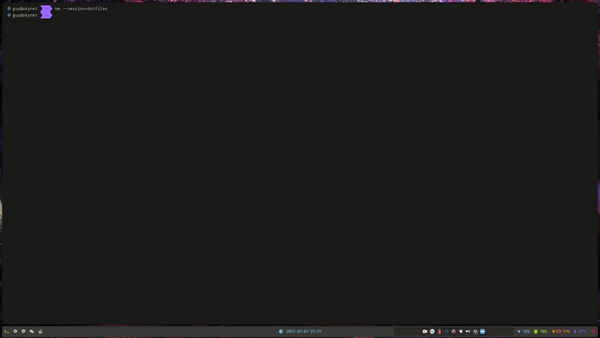
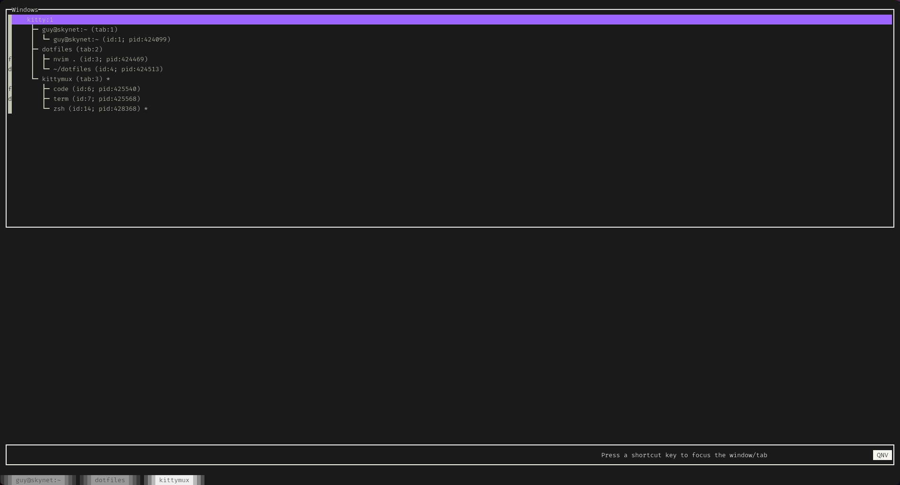

# kittymux

One of the useful things about tmux is its session/window browser. This is a tool to give 
kitty that same superpower. The idea is to bind a hotkey to run it in a new window in kitty 
so that you can jump to known windows whenever you want. 



## Features

* Easily view a list of all OS Windows, Tabs, and Windows within Kitty
* Easily navigate the aforementioned
* Save/Restore tabs (treating them a little like tmux sessions)

## Just want to use it?

### Installation Instructions

Install as a global package with npm:
```
npm install -g @guysherman/kittymux
```

### Kitty setup instructions

The main thing you need is to make sure kitty allows remote control. On linux you can do this by running kitty with the following commandline args:
```
kitty -o allow_remote_control=yes --single-instance --listen-on unix:@mykitty
```

You can see the [Kitty docs](https://sw.kovidgoyal.net/kitty/remote-control/) for more info on that.

Then set up a keybind in your `kitty.config`:
```
map ctrl+shift+k launch --type=overlay zsh -c "PATH=/home/guy/.nvm/versions/node/v16.13.1/bin:$PATH km"
```

NB: I had to run it in my shell, and make sure my node installation was on my path in order to get it to work. This will depend on how you have node installed.

### Usage instructions

**Basic Usage**

To run kittymux, simply run `km` at the terminal. This brings up the list of OS Windows, Tabs and Windows. You can navigate up and down the list with
`j/k` (down/up respectively). Or you can jump to tabs with `J/K` (again down/up respectively). Press enter to focus a given entry in the list.

**Name Tabs and Windows**

You can rename a tab or window by highlighting, and then hitting `a`. You are then prompted to enter a new name for the tab.

**Bookmarks**

Kittymux also supports bookmarks (called quicknavs). To assign a bookmark to an entry in the list, hit `m`, followed by a character or number.
To quickly access a bookmarked entry, hit `'` then the same character. You can only jump to bookmarks in the current tab, and multiple entries
(in different tabs) can share the same bookmark. This is useful when we talk about saved sessions. To cancel jumping to a bookmark, just hit `Esc`.

The image below shows kitty while it is waiting for the user to select a bookmark. The assigned bookmarks are highlighted in the first column.



**Save/Load Tabs**

You can save a tab by highlighting it in the list and hitting `s`. And if you later want to restore that tab, from the terminal you can
run `km --session=<tab name>` to reload the tab. If you launch a session that is already loaded, it will just be focused instead. This way,
you can bind a command to load a session to a shortcut key, and it will serve to load or focus the session. eg:

```
map ctrl+shift+9 launch --type=overlay zsh -c "PATH=/home/guy/.nvm/versions/node/v16.13.1/bin:$PATH km --session=kittymux"
```

*NB: You should name your tabs before saving them, otherwise weird stuff will happen*

To quit you can hit `:` followed by `q`, or `ctrl+c`.

## Hacking on it:
You might find you need to modify treecat (a react-like wrapper around the underlying text-ui framework) as well, so what I would do is:

```
git clone git@github.com:guysherman/treecat
cd treecat
npm link
cd ..

git clone git@github.com:guysherman/kittymux
cd kittymux
npm link @guysherman/treecat
npm install
```

If you need to make a change to treecat, make the change and then `yarn build` and it should get picked up right away.

## Keys:

* `j` / `k` - Move down / up the list
* `a` - rename the selected window/tab
* `x` - close the selected window/tab
* `m<key>` - bind `<key>` to the selected window/tab (kinda like vim marks)
* `'<key>` - focus the window bound to `<key>` (kinda like vim marks)

## Key binds

As mentioned above you can bind shortcuts, somewhat like vim marks, to windows or tabs. These are stored in
`$XDG_STATE_DIR/kittymux/quicknavs.json` by default. You can override this by setting `$KITTYMUX_STATE_DIR`, in which
case it will be stored in `$KITTYMUX_STATE_DIR/kittymux/quicknavs.json`.

These get pruned whenever the list is refreshed, so modifying the file manually is pointless.
