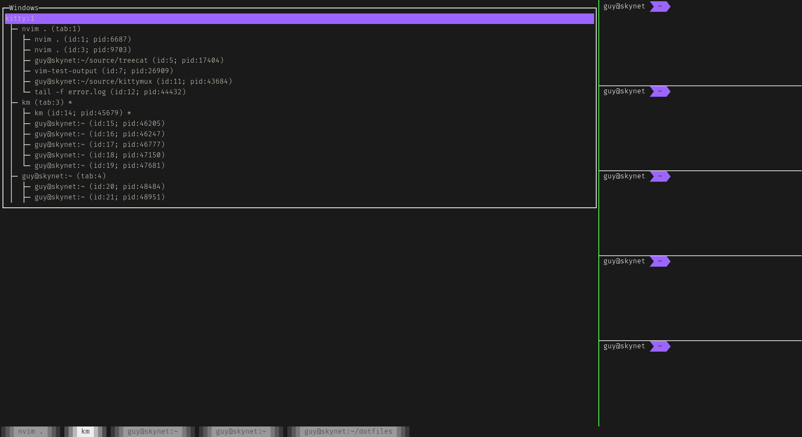

# kittymux

One of the useful things about tmux is its session/window browser. This is a tool to give 
kitty that same superpower. The idea is to bind a hotkey to run it in a new window in kitty 
so that you can jump to known windows whenever you want. 



Still working on things like useful hotkeys, keybinding, etc to make it easy to manage windows without using a mouse etc.

Very much a work in progress, but issues and comments welcome :)

## Just want to use it?

Install as a global package with npm:
```
npm install -g @guysherman/kittymux
```

Then set up a keybind in your `kitty.config`:
```
map ctrl+shift+k launch --type=overlay zsh -c "PATH=/home/guy/.nvm/versions/node/v16.13.1/bin:$PATH km"
```

NB: I had to run it in my shell, and make sure my node installation was on my path in order to get it to work. This will depend on how you have node installed.

## Hacking on it:
You might find you need to modify treecat as well, so what I would do is:

```
git clone git@github.com:guysherman/treecat
cd treecat
npm link
cd ..

git clone git@github.com:guysherman/kittymux
cd kittymux
npm link @guysherman/treecat
npm install
```

If you need to make a change to treecat, make the change and then `yarn build` and it should get picked up right away.

## Keys:

* `j` / `k` - Move down / up the list
* `a` - rename the selected window/tab
* `x` - close the selected window/tab
* `m<key>` - bind `<key>` to the selected window/tab (kinda like vim marks)
* `'<key>` - focus the window bound to `<key>` (kinda like vim marks)

## Key binds

As mentioned above you can bind shortcuts, somewhat like vim marks, to windows or tabs. These are stored in
`$XDG_STATE_DIR/kittymux/quicknavs.json` by default. You can override this by setting `$KITTYMUX_STATE_DIR`, in which
case it will be stored in `$KITTYMUX_STATE_DIR/kittymux/quicknavs.json`.

These get pruned whenever the list is refreshed, so modifying the file manually is pointless.
